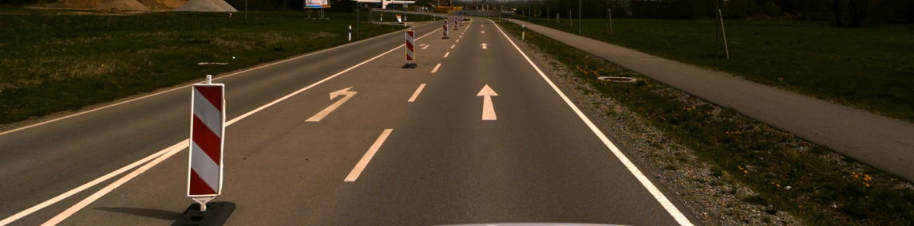
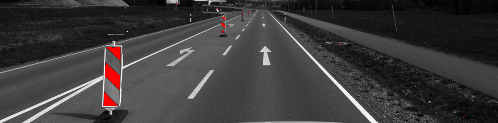

# Illumination-invariant image processing
This repository provides a Matlab-based software project that will be used in the course "Illumination-invariant image processing" in the course ***"Automotive Sensors and Actuators (ASAA)"*** in the summer semester 2024. 

The provided software can be used to address robust (with respect to different lighting situations) segmentation, e.g. to identify a potentially drivable area in front of a car. Furthermore, we demonstrate the application of the pinhole camera model to determine the distance of an object identified (using YOLOV4/Darknet) in front of the camera. Assuming that the object fits in the ground plane (Z=0), we can estimate the distance (X, Y) of the object (from pixel) with a monocular camera system. 

  

## Road segmentation

### Color space convertion
The selected color space is HSI which builds from Hue, Saturation and Intensity. It is determined according to 
### Road segmentation flow

    

### Color pattern

## Probability-based color segmentation

### Color model

    

### Application

  
  

## Software requirements
All functions are implemented and tested using either Matlab 2024a or Python 3.8.19.

## Literature
- [Rotaru et al.](https://link.springer.com/article/10.1007/s11554-008-0078-9)
- [Sotelo et al.](https://link.springer.com/article/10.1023/B:AURO.0000008673.96984.28)
